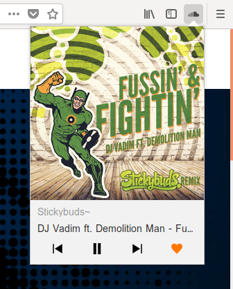

# SoundCloud Control

A browser extension that lets you control the SoundCloud player without switching tabs.



__Features:__
* Easily toggle playback or skip songs from the popup or via keyboard shortcut
* Open SoundCloud in a new tab if not open yet
* Like and unlike the song you are currently listening to from the popup

__Keyboard Shortcuts:__

Toggle SoundCloud playback

`Shift` + `Ctrl` + `5`

Rewind song playing on SoundCloud

`Shift` + `Ctrl` + `6`

Skip to next song on SoundCloud

`Shift` + `Ctrl` + `7`

Due to the varying default shortcuts on different operating system and user preference shortcuts can be changed in the addon preferences.

Keyboard shortcuts should consist of two or three keys:

  * __modifier__ This can be any of: "Ctrl", "Alt", "Command", "MacCtrl".
  * __secondary modifier (optional)__ For now only the *Shift* key is supported
  * __key (mandatory)__ This can be any one of:
    * the letters A-Z
    * the numbers 0-9
    * the function keys F1-F12
    * Comma, Period, Home, End, PageUp, PageDown, Space, Insert, Delete, Up, Down, Left, Right

__Note:__ If a key combination is already used by the browser, or by an existing add-on, then you can't override it. You will be allowed to define it, but your event handler will not be called when the user enters it. On Mac the Command or `⌘` key might fail to register in that case recording can be canceled by pressing `esc`.

### Development

```
npm install
npm run build:js
# or to watch changes
npm run build:js:watch
npm run ff
```

All Icons used are taken from [iconmonstr](https://iconmonstr.com/).
